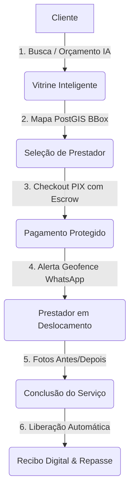

# 📖 Manual Executivo & Guia de Demonstração — Severinno Marketplace SaaS

> **Versão:** 2.0 (Master Release)  
> **Arquitetura:** 100% Open Source (Next.js 16 + React 19 + PostGIS 3.4 + Redis 8 + LocalAI Llama 3.1 + OSRM)  
> **Custo Recorrente de APIs Externas:** **R$ 0,00 / mês**

---

## 🎯 1. Visão Geral do Produto

O **Severinno** é uma plataforma SaaS completa de marketplace de serviços locais construída para conectar clientes a profissionais autônomos com máxima confiança, velocidade e conversão.



---

## 💰 2. Diferencial Econômico (Economia de Infraestrutura)

| Recurso                                          | Soluções de Mercado Tradicionais         | Severinno Marketplace          | Economia               |
| ------------------------------------------------ | ---------------------------------------- | ------------------------------ | ---------------------- |
| **Inteligência Artificial (Orçamentos & Busca)** | OpenAI GPT-4 ($0.03 / 1k tokens)         | **LocalAI Llama 3.1 8B Local** | **100% Grátis (R$ 0)** |
| **Mapas & Roteirização**                         | Google Maps API ($5 a $10 / 1k requests) | **OSRM + MapLibre GL + OSM**   | **100% Grátis (R$ 0)** |
| **Banco de Dados Espacial**                      | Serviços Gerenciados Proprietários       | **PostgreSQL + PostGIS 3.4**   | **Open Source**        |
| **Mensageria WhatsApp**                          | Twilio / Z-API ($0.05 / msg)             | **Evolution API Gateway**      | **Instância Própria**  |

---

## 👥 3. Personas & Credenciais de Teste

| Perfil                 | Email                           | Senha           | Destaques                                           |
| ---------------------- | ------------------------------- | --------------- | --------------------------------------------------- |
| **Administrador**      | `admin@severinno.app`           | `Admin@123456`  | Aprovação KYC, Gestão de Disputas, Métricas Globais |
| **Prestador Diamante** | `carlos.eletrica@severinno.app` | `Prestador@123` | Nível Diamante, Central Financeira, Zonas no Mapa   |
| **Cliente Padrão**     | `maria.cliente@severinno.app`   | `Cliente@123`   | Orçador com IA, Pagamento PIX, Severinno Club       |

---

## 🎬 4. Roteiro de Demonstração em 7 Passos

### 📍 Passo 1: Orçamento Instantâneo com IA Local

1. Acesse a vitrine inicial (`/`).
2. Clique no botão de destaque **"✨ Orçar com IA Local"** no Hero.
3. Descreva o problema: _"Preciso trocar 4 tomadas e instalar um chuveiro 220V no meu apartamento em Pinheiros"_.
4. A IA do LocalAI categoriza instantaneamente, sugere a faixa de preço e lista os prestadores ideais com **Smart Match Semântico**.

### 🗺️ Passo 2: Busca Espacial no Mapa com MapLibre GL

1. Acesse `/busca`.
2. O mapa vetorial renderiza pins esmeralda com o preço de partida dos prestadores (`R$ 120`).
3. Arraste o mapa e clique em **"📍 Buscar nesta área do mapa"** para acionar a query PostGIS Bounding Box.

### 💳 Passo 3: Contratação com PIX Inline & Custódia (Escrow)

1. Escolha o serviço e avance para o checkout.
2. O modal gera o QR Code PIX dinâmico com anel circular de 15 minutos e cópia-e-cola.
3. Ao pagar, o valor entra em **Custódia Protegida (Escrow)**, sem risco de golpe para o cliente.

### 🚗 Passo 4: Deslocamento, OSRM & Geofencing

1. O prestador inicia o deslocamento no painel `/tracking/[id]`.
2. A taxa de deslocamento é calculada pela quilometragem viária real.
3. Ao se aproximar a menos de 1 km (ou $\le$ 5 min), o sistema dispara um WhatsApp automático: _"🚗 [Nome] está a cerca de 5 minutos do seu endereço!"_.

### 📸 Passo 5: Comprovação Antes / Depois & Liberação de Custódia

1. O prestador sobe as fotos do serviço no app.
2. O cliente confirma com o código PIN (ou o sistema auto-libera em 72h).
3. O valor é repassado automaticamente via split PIX para a conta do prestador.

### 📊 Passo 6: Central Financeira & Emissão de Recibo Digital

1. No dashboard do prestador, acesse a aba **"Financeiro & Recibos"**.
2. Veja o extrato com saldos liberados e em custódia.
3. Clique em **"Recibo"** para visualizar e imprimir o documento oficial autenticado por **Hash SHA-256**.

### 🔄 Passo 7: Assinatura Recorrente (Severinno Club)

1. Para serviços periódicos (diaristas, manutenção de piscina, jardinagem), selecione o plano **Semanal (10% OFF)** ou **Quinzenal (5% OFF)**.
2. As visitas futuras são agendadas automaticamente na agenda do prestador com sincronização iCal/Google Calendar.

---

## 🚀 5. Comandos Rápidos

```bash
# Iniciar ambiente de desenvolvimento
bun run dev

# Executar todas as suítes de testes automatizados
bun vitest run

# Checagem de integridade de tipos
bun run tsc --noEmit

# Build de produção
bun run build
```
