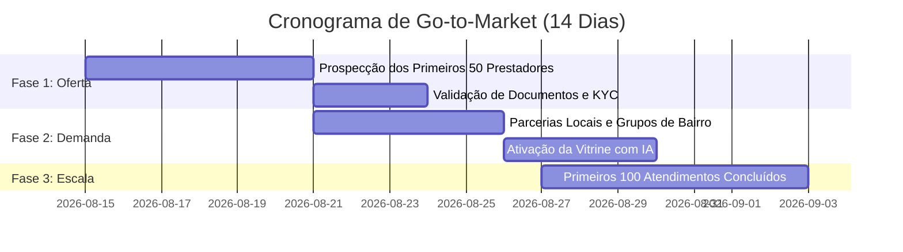

# 🚀 Playbook de Go-To-Market & Lançamento — Severinno Marketplace SaaS

> **Meta Inicial:** Recrutar e ativar os primeiros **50 prestadores verificados** em até **14 dias**.  
> **Mercado Piloto:** 1 Cidade ou Região Metropolitana com densidade populacional média/alta.

---

## 🎯 1. Estratégia de Atração de Oferta (Prestadores)

Em marketplaces de serviços, a **oferta atrai a demanda**. Antes de investir em anúncios para clientes, a plataforma precisa de no mínimo **5 a 10 profissionais de excelência por categoria principal**:
1. Eletricistas & Encanadores
2. Diaristas & Faxinas
3. Pintores & Pequenas Reformas
4. Montadores de Móveis
5. Técnicos de Ar-condicionado

---

## 📱 2. Scripts Prontos de Prospecção (Copiar & Colar)

### 💬 Script 1: Abordagem via WhatsApp / Instagram DM

```text
Olá, [Nome do Profissional]! Tudo bem?

Vi que você realiza serviços de [Eletricista/Pintura/Encanamento] aqui na região de [Nome do Bairro/Cidade]. 

Estamos inaugurando o Severinno na nossa cidade — uma plataforma onde você recebe pedidos de orçamentos e agendamentos direto no seu celular, com pagamento 100% garantido no PIX antes de iniciar o serviço.

✅ Zero mensalidade fixa (você não paga nada para se cadastrar)
✅ Você escolhe seus horários e bairros de atendimento
✅ Selo de Prestador Verificado com destaque nas buscas

Estamos selecionando os 20 primeiros profissionais pioneiros para receberem os primeiros chamados.

Gostaria de criar seu perfil gratuito em 2 minutos? Segue o link:
👉 https://severinno.app/?view=provider.services
```

---

### 🏪 Script 2: Parceria com Lojas de Material de Construção / Elétrica

**Proposta para o Dono da Loja:**
* Colocar um totem ou display de balcão com QR Code: *"Precisa de um instalador para o seu material? Escaneie aqui e encontre profissionais recomendados no Severinno"*.
* **Contrapartida:** Os prestadores cadastrados no Severinno recebem cupom de 5% a 10% de desconto para comprar na loja parceira.

---

## 📅 3. Cronograma de Lançamento em 3 Fases (14 Dias)



---

## 📊 4. Métricas-Chave de Sucesso (KPIs de Lançamento)

| Métrica | Meta da Semana 1 | Meta da Semana 2 | Meta do Mês 1 |
|---|---|---|---|
| **Prestadores Cadastrados** | 25 | 50 | 150 |
| **Prestadores com KYC Aprovado** | 15 | 35 | 100 |
| **Orçamentos Criados por IA** | 30 | 100 | 400 |
| **Agendamentos Concluídos** | 10 | 40 | 180 |
| **GMV Transacionado** | R$ 1.800 | R$ 7.200 | R$ 32.000 |
| **NPS / Avaliação Média** | > 4.8 ★ | > 4.8 ★ | > 4.8 ★ |

---

## 🛡️ 5. Blindagem e Retenção
1. **Atendimento VIP:** Acompanhar os primeiros 20 serviços de perto com suporte ativo no WhatsApp.
2. **Garantia de Pagamento:** Destacar o Escrow em todas as comunicações para garantir confiança absoluta entre ambas as partes.
