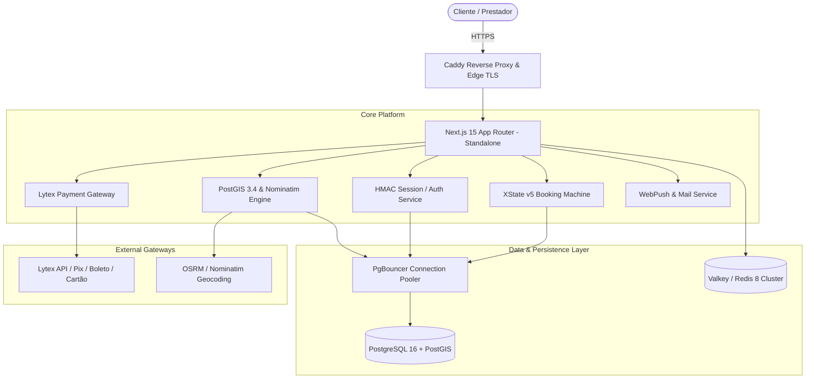
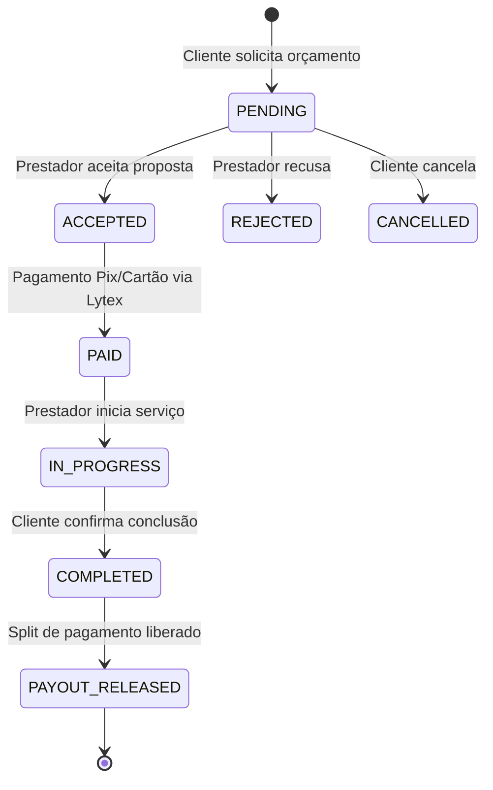

# Arquitetura Geral do Sistema — Severinno Marketplace SaaS

> Visão holística da arquitetura de software, fluxos de dados, componentes e infraestrutura do Severinno.

---

## 🗺️ 1. Diagrama de Arquitetura C4 (System Context)

---

## 🏛️ 2. Mapeamento das Camadas Técnicas

| Camada                   | Tecnologias Principais                         | Padrões Arquiteturais                                                                          |
| ------------------------ | ---------------------------------------------- | ---------------------------------------------------------------------------------------------- |
| **Apresentação & UI**    | React 19, Tailwind CSS, Radix UI, Lucide       | Design System Emerald, Code-Splitting (`next/dynamic`), WCAG 2.1 AA                            |
| **Máquinas de Estado**   | XState v5, React Query, Zustand                | FSM para ciclo de vida de agendamentos (`PENDING` → `CONFIRMED` → `IN_PROGRESS` → `COMPLETED`) |
| **Borda & Segurança**    | Next.js Middleware, HMAC SHA-256               | HSTS Preload, Rate Limiting distribuído no Redis, CORS estrito, CSP                            |
| **Negócio & Pagamentos** | Lytex SDK, Webhooks Idempotentes               | Split de pagamento com taxa de plataforma, Lock distribuído Redis (300s TTL)                   |
| **Geoespacial**          | PostGIS 3.4, ST_DWithin, GiST Index            | Cache multi-nível (L1 Memory, L2 Redis, L3 DB), fallback Haversine JS                          |
| **Persistência**         | PostgreSQL 16, Prisma ORM, PgBouncer           | Native Enums PostgreSQL, Soft Delete Extension, Migrations versionadas                         |
| **Observabilidade**      | Pino Logger, GlitchTip / Sentry, OpenTelemetry | Rastreamento distribuído, DLQ Monitor, Health Check detalhado                                  |
| **CI/CD & Qualidade**    | GitHub Actions, Vitest, Playwright, Husky      | Testes de integração, pre-commit com barrel lint e validação UTF-8                             |

---

## 🔄 3. Ciclo de Vida do Agendamento (FSM)

---

## 📚 4. Índice de Guias Técnicos Detalhados

- 📖 [Manual Operacional de Produção](file:///c:/PROJETOS/severinno/docs/RUNBOOK.md)
- 💳 [Arquitetura de Pagamentos & Split](file:///c:/PROJETOS/severinno/docs/payments-architecture.md)
- 🌍 [Arquitetura Geoespacial & PostGIS](file:///c:/PROJETOS/severinno/docs/geolocation-architecture.md)
- ⚡ [Estratégia de Cache Multi-Nível](file:///c:/PROJETOS/severinno/docs/CACHE_STRATEGY.md)
- 🛡️ [Manual de Segurança & Hardening](file:///c:/PROJETOS/severinno/docs/SECURITY.md)
- 🧪 [Guia de Testes & Cobertura](file:///c:/PROJETOS/severinno/docs/TESTING.md)
