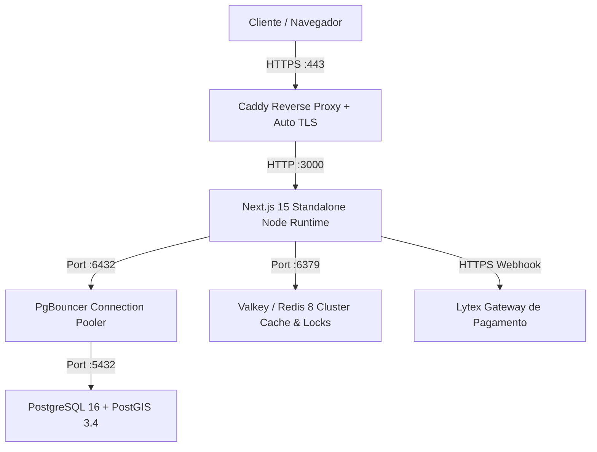

# Runbook Operacional & Manual de Produção — Severinno

> Guia operacional definitivo para deployment, monitoramento, backup, recuperação de desastres e manutenção da plataforma Severinno.

---

## 🏗️ 1. Arquitetura de Infraestrutura

A aplicação roda em stack conteinerizada otimizada para alta performance e disponibilidade:



---

## 🚀 2. Procedimento de Deploy (Zero-Downtime)

### 2.1 Pre-Flight Checklist

Antes de qualquer release em ambiente de produção:

1. Validar integridade dos testes: `bun run test:run` (100% passing).
2. Validar tipagem TypeScript: `bun run typecheck`.
3. Executar o smoke test de produção: `bun scripts/smoke-test-prod.ts`.

### 2.2 Comandos de Deploy

```bash
# 1. Atualizar repositório
git pull origin main

# 2. Instalar dependências e gerar cliente Prisma
bun install --frozen-lockfile
bun run db:generate

# 3. Aplicar migrations pendentes do banco
bunx prisma migrate deploy

# 4. Compilar bundle standalone de produção
BUILD_STANDALONE=true bun run build

# 5. Reiniciar container da aplicação
docker compose restart web
```

---

## 💾 3. Backups e Recuperação de Desastres

### 3.1 Backup Automatizado do Banco

O script automatizado gera dump comprimido com schemas e triggers PostGIS:

```bash
# Execução manual ou via cron diário (03:00 AM)
./scripts/backup-db.sh
```

_Destino:_ `/backups/postgres_YYYYMMDD_HHMMSS.sql.gz`

### 3.2 Procedimento de Restauração (Restore)

```bash
# Restaurar a partir do snapshot mais recente
./scripts/restore-db.sh /backups/postgres_20260813_030000.sql.gz
```

---

### 3.3 Backup da Forja (Gitea) — diário, com verificação e off-site

> A forja (git + registry OCI) vive no volume docker `gitea-data` da VPS. O backup dela tem DUAS famílias de artefato: o export oficial (`gitea dump`) para restauração e um `git bundle` por repositório (formato git puro, sobrevive a qualquer forja). Forja vazia é estado declarado no manifest, não falha.

**Na VPS (`/root/forge-backup.sh`, cron 04:30 — sincronizado com `scripts/forge-backup.sh` do repo):**

```bash
# manual: bash /root/forge-backup.sh
# artefatos: /root/backups-forja/<dia>/{forge-dump.zip, git-*.bundle, manifest.txt, sha256sums.txt}
# retenção local: 14 dias
```

**Off-site (na máquina local, `scripts/forge-backup-pull.sh`, cron 05:15):**

```bash
# puxa o dia, confere sha256 contra o manifest DA VPS e verifica cada bundle (git bundle verify)
bash scripts/forge-backup-pull.sh [dia]
# destino: ~/backups-forja/<dia>/ — retenção local: 30 dias
```

**Por que o pull e não o push:** a VPS não guarda credencial do destino off-site — uma VPS comprometida não apaga nem corrompe a cópia que fica fora dela. Um backup sem verificação é esperança, não backup: o `sha256sum -c` local e o `git bundle verify` são o que tornam o artefato confiável no dia do desastre.

**Restauração da forja a partir do dump** — PROVADA em desastre simulado (29/09/2026, stack efêmera: o Gitea restaurado bootou e serviu a API). O Gitea 1.22 NÃO tem comando `restore` completo (só `dump`/`dump-repo`/`restore-repo`): o caminho é repor o volume a partir do zip:

```bash
# 1. para o app e o runner (o gitea para no passo 3)
docker compose -f deploy/docker-compose.gitea.yml stop runner
# 2. unzip do dump do dia (contém data/, app.ini e gitea-db.sql)
rm -rf /tmp/restore && mkdir -p /tmp/restore && cd /tmp/restore
unzip -q /root/backups-forja/<dia>/forge-dump.zip
# 3. para a forja e REPÕE o volume (data/ + conf do app.ini)
docker compose -f deploy/docker-compose.gitea.yml stop gitea
docker run --rm -v <volume-do-gitea>:/data -v /tmp/restore:/backup alpine sh -c \
  'cp -a /backup/data/. /data/ && mkdir -p /data/gitea/conf && cp /backup/app.ini /data/gitea/conf/app.ini'
docker compose -f deploy/docker-compose.gitea.yml up -d
# 4. a prova: curl https://git.severinno.com/api/v1/version → 200
```

**Alerta de falha (`scripts/forge-backup-alert.mjs`, cron local 05:20):** lê o manifest do dia e sai fail-closed — sem manifest (cron não rodou), sem "FIM OK" (morreu no meio) ou artefato do sha256sums ausente abrem issue com o marcador canônico (`issue-publish.mjs`); o dia com FIM OK reconcilia (fecha) as issues que o próprio alerta abriu. Issue com o label mas sem marcador NÃO é fechada por automatismo.

**Backend gitea — PROVADO E2E contra a forja real (29/09, stack de bring-up):** FALHA → issue criada; OK → reconciliação FECHOU a issue (`state=closed` verificado pela API). Pós-restore, o cron local 05:20 vira:

```bash
GITEA_URL=https://git.severinno.com \
GITEA_TOKEN=<token do usuário de serviço> \
GITEA_REPOSITORY=<owner>/<repo-de-alertas> \
node scripts/forge-backup-alert.mjs --backend gitea
```

Lições da prova: o token precisa dos escopos **`write:user,write:issue,write:repository`** (sem `write:user` a API recusa a criação de repo com "token does not have at least one of required scope(s)"); e o usuário criado via CLI nasce com must-change-password — desligar com `--must-change-password=false` no `change-password`. Na VPS, o alerta alcança a forja pela rede bridge (`http://172.18.0.3:3000` ou o IP do container) sem expor a porta ao host; off-site, só via `https://git.severinno.com` (DNS pendente).

**Pré-requisito do 100% self-hosted (verificado em 29/09):** a forja de bring-up novo nasce SEM `/data/git/repositories` — o `forge-backup.sh` cria o dir antes do dump. Forja vazia (`bundles: 0`) é estado normal, não erro.

---

## 🛡️ 4. Monitoramento & Alertas

### 4.1 Health Check Endpoints

- **Liveness:** `GET https://severinno.com.br/api/health` → Retorna status básico HTTP 200.
- **Deep Check:** `GET https://severinno.com.br/api/health/detailed` → Avalia latência de PostgreSQL, Redis, PostGIS e serviços externos.

### 4.2 Métricas do PgBouncer

- **Pool Status:** `GET https://severinno.com.br/api/admin/pgbouncer` (Requer autenticação ADMIN).

---

## 🔒 5. Segurança & Variáveis Críticas

| Variável               | Descrição                                             | Importância |
| ---------------------- | ----------------------------------------------------- | :---------: |
| `DATABASE_URL`         | String de conexão via PgBouncer                       | 🔴 Crítico  |
| `SESSION_SECRET`       | Chave de assinatura de cookies HMAC (32+ caracteres)  | 🔴 Crítico  |
| `CRON_SECRET`          | Bearer token para execução de crons externas          | 🔴 Crítico  |
| `LYTEX_API_TOKEN`      | Token da API de pagamentos Lytex                      | 🔴 Crítico  |
| `LYTEX_WEBHOOK_SECRET` | Segredo de validação de assinatura do webhook         | 🔴 Crítico  |
| `CSP_REPORT_ONLY`      | `1` (default) = CSP em modo observação; `0` = enforce | 🟡 Rollout  |
| `CSP_ENFORCE`          | Kill-switch para enforce imediato (prioridade máxima) | 🟡 Rollout  |

---

## 📜 6. Rollout da CSP com nonce (Report-Only → Enforce)

> A CSP estrita (nonce + `strict-dynamic`) já está implementada em
> `src/lib/csp.ts` e ativada no `proxy.ts` (middleware Edge). O que muda por
> estágio é apenas o HEADER enviado (`Content-Security-Policy-Report-Only` vs
> `Content-Security-Policy`) — controlado por variáveis de ambiente, sem
> redeploys de código.

### 6.1 Os três estágios

| Estágio                                 | Envs do container `app`                 | Efeito                                                                                                              |
| --------------------------------------- | --------------------------------------- | ------------------------------------------------------------------------------------------------------------------- |
| **1. Observação** (default em produção) | `CSP_REPORT_ONLY=1` (ou ausente)        | Header `Content-Security-Policy-Report-Only`: violações são reportadas a `/api/csp-report` mas **nada é bloqueado** |
| **2. Enforce com kill-switch**          | `CSP_ENFORCE=1`                         | Header `Content-Security-Policy`: bloqueia de verdade. Remover `CSP_ENFORCE` volta à observação na hora             |
| **3. Estável**                          | `CSP_REPORT_ONLY=0` (sem `CSP_ENFORCE`) | Enforce como estado permanente no compose                                                                           |

`CSP_ENFORCE` tem **prioridade** sobre `CSP_REPORT_ONLY` (ver `proxy.ts`).

### 6.2 Como trocar de estágio

```bash
# Na VPS, no diretório do compose de produção:

# → Estágio 2 (enforce com kill-switch):
#   export CSP_ENFORCE=1 ANTES do compose up (o compose lê do shell/.env)
sudo bash -c 'export CSP_ENFORCE=1 && docker compose -f docker-compose.prod.yml up -d app'

# KILL-SWITCH (voltar à observação em segundos, sem novo deploy):
sudo bash -c 'unset CSP_ENFORCE && docker compose -f docker-compose.prod.yml up -d app'

# → Estágio 3 (estável): editar .env do host com CSP_REPORT_ONLY=0 e subir:
sudo docker compose -f docker-compose.prod.yml up -d app

# Confirmar qual header está saindo:
curl -sI https://severinno.com.br/ | grep -i content-security
```

### 6.3 Monitoramento das violações

- **Coleta**: browsers POSTam as violações em `POST /api/csp-report`
  (log estruturado Pino → Loki; `script-src` em produção também dispara
  alerta no Sentry — potencial XSS).
- **Painel operacional**: `GET /api/csp-report` (apenas ADMIN, cookie de
  sessão) agrega as violações dos logs do container e responde com o status
  do rollout:

```bash
curl -s -H "cookie: severinno_session=<sessão admin>" \
  "https://severinno.com.br/api/csp-report?lines=500" | jq '{total, byDirective, rollout}'
```

- `rollout.readyToEnforce: true` = zero violações das diretrizes bloqueantes
  (`script-src`, `object-src`, `base-uri`, `frame-ancestors`) na janela lida.
- `blockingViolations[]` lista o que IMPEDIRIA o enforce, com recomendação
  por diretriz (`rollout`).
- `styleSummary` separa `style-src-attr` (atributo `style="..."` — a dívida
  que docs/STYLE_MIGRATION_PLAN.md elimina) de `style-src-elem`
  (`<style>`/`<link>` — pin de hash do global-error + guard), cada um com
  `count`, top origens/documentos e a `action` orientada; é a leitura que
  decide a próxima rodada de endurecimento (remoção do `'unsafe-inline'` de
  `style-src-attr`). Nota: browsers antigos reportam a diretiva genérica
  `style-src` — esses aparecem só no `byDirective` global.
- `diagnostics.dockerLogsError` presente = a rota não conseguiu ler os logs
  (rodar na VPS ou usar `docker compose logs app` manualmente).

### 6.4 Critério de avanço (checklist)

1. [ ] Estágio 1 ativo por **≥ 14 dias** cobrindo tráfego real (inclusive
       fim de semana, checkout e dashboards admin).
2. [ ] **Duas janelas de 24h seguidas** com `GET /api/csp-report` retornando
       `readyToEnforce: true` e `total` estável/decrescente.
3. [ ] Violações residuais de diretrizes não-bloqueantes (img/style/connect)
       avaliadas: ou allowlist na lib (`src/lib/csp.ts`), ou aceitas como
       degradação tolerável.
4. [ ] Janela de mudança acordada + plano de rollback (kill-switch do 6.2)
       comunicado ao time.
5. [ ] Após o enforce: monitorar `/api/csp-report` e o Sentry por 48h;
       qualquer bloqueio legítimo → kill-switch imediato e análise.

### 6.5 Falsos positivos comuns (não são blockers reais)

- **Extensões de navegador** injetam scripts/styles sem nonce — aparecem como
  violações de script/style-src de origens tipo `chrome-extension://`.
- **Bookmarklets e devtools** do próprio time.
- **eval dinâmico** de bibliotecas antigas — aparece como violação de
  `script-src` com `'unsafe-eval'` no `source-file`; investigar antes do
  enforce.
- Em dúvida: a diretriz só impede o enforce se estiver em
  `blockingViolations`; o resto pode seguir com allowlist graduada.

---

## 🧹 7. Remediação de SVG legado no bucket (`reprocess-svg-uploads.ts`)

SVG foi REMOVIDO da allowlist de upload (`src/lib/file-signature.ts`,
09/2026) — é XML ativo (`<script>`, `onload=`, `<foreignObject>`) e, servido
do bucket público na mesma origem, é XSS armazenado. Objetos enviados
ANTES do bloqueio continuam no bucket; este procedimento os encontra e os
substitui por rasters (PNG), preservando o original em quarentena.

A defesa em profundidade no edge é o bloco `s3` do `Caddyfile.prod` (403
para qualquer resposta `Content-Type: image/svg+xml`); a remediação abaixo
elimina a causa. O alarme contínuo é o cron semanal
`/api/cron/svg-legacy-census` (dom 03:30) — alerta enquanto `svgFound > 0`.

### 7.1 Censo: quantos SVG legado existem?

Três caminhos (todos dry-run, leitura pura — só `list` + `get`):

```bash
# (a) Gatilho manual: Actions → Deploy → Run workflow com census_only=true
#     (job svg-legacy-census no deploy.yml; o svgFound aparece no log).

# (b) Cron semanal: ~/cron-logs/svg-census.log na VPS (dom 03:30).

# (c) Direto na VPS, do diretório do compose ($DEPLOY_PATH):
#     --delete no CENSO: dry-run sem sharp (o container app NAO o tem —
#     standalone); svgFound e identico ao modo convert.
docker compose run --rm --no-deps -v ./scripts:/app/scripts:ro app \
  bun scripts/reprocess-svg-uploads.ts --delete
```

Leitura do resumo: `scanned` (objetos avaliados), `svgFound` (SVG legado
presente), `wouldConvert` (o que o `--apply` converteria), `failed`,
`skippedTooLarge` (>15MB, não avaliados por conteúdo). Detecção PELO
CONTEÚDO: extensão não é confiável (um `.jpg` pode ser SVG renomeado).

### 7.2 Pré-condições do `--apply`

1. **Dry-run rodou limpo** no mesmo host (o `.env` do `DEPLOY_PATH` fornece
   as `S3_*`; o `S3_ENDPOINT=http://minio:9000` resolve dentro da rede
   Docker — o MinIO de produção não publica porta no host).
2. **node_modules no host** (o `bun install` do §2 passo 2) — o runtime
   standalone do app NÃO traz `sharp` (binário nativo; só o script o usa).
3. **Snapshot do volume do MinIO** (cinto-e-suspensórias; a quarentena por
   objeto já é o rollback primário):

```bash
docker volume ls | grep minio   # identifique o volume (ex.: severinno_minio_data)
docker run --rm -v <volume>:/data -v /root/backups:/backup alpine \
  tar czf /backup/minio-$(date +%F).tgz -C /data .
```

### 7.3 Janela e execução

**Janela:** domingo 03:30–05:00 (logo após o settlements 03:00 e o censo
semanal; fora do pico). Sem downtime do app; por objeto convertido há uma
janela de segundos em que a chave troca de SVG para PNG (raster já gravado
antes da remoção do original — a ordem é quarentena → PNG → delete).

```bash
cd $DEPLOY_PATH

docker compose run --rm --no-deps --user root \
  -v "$PWD":/repo -w /repo app \
  sh -c "bun install --frozen-lockfile && bun scripts/reprocess-svg-uploads.ts --apply"
```

Por que este formato: monta o REPO no container do app (rede `backend`,
bun disponível) e instala as deps DENTRO dele — garante o binário `sharp`
da plataforma da imagem (glibc/musl do host pode divergir). `--user root`
porque a imagem roda como `nextjs` (não-root) e o install grava
`node_modules` no mount (o deploy roda como root — ver §2). `-v ./scripts
:/app/scripts` NÃO basta aqui: sem `sharp` o script aborta com "sharp
indisponível". `--delete` em vez de `--apply` remove os SVGs sem converter
(último recurso; a política é converter). Exit 0 = concluído; exit 2 =
concluído com falhas (ver `errors[]` — originais preservados).

### 7.4 Verificação pós

```bash
# 1. Re-dry-run: DEVE dar svgFound: 0 — critério de fim (o alarme semanal
#    silencia sozinho no próximo domingo).
docker compose run --rm --no-deps -v ./scripts:/app/scripts:ro app \
  bun scripts/reprocess-svg-uploads.ts --delete

# 2. Contagem de quarentena == nº de objetos convertidos:
docker compose run --rm --no-deps -v "$PWD":/repo:ro -w /repo app \
  bun -e "const {S3Client,ListObjectsV2Command}=require('@aws-sdk/client-s3');const c=new S3Client({endpoint:process.env.S3_ENDPOINT,region:'auto',credentials:{accessKeyId:process.env.S3_ACCESS_KEY,secretAccessKey:process.env.S3_SECRET_KEY},forcePathStyle:true});let n=0,t;do{const r=await c.send(new ListObjectsV2Command({Bucket:process.env.S3_BUCKET,Prefix:'quarantine/svg-legacy/',ContinuationToken:t}));n+=(r.Contents??[]).length;t=r.IsTruncated?r.NextContinuationToken:undefined}while(t);console.log('quarantine/svg-legacy:',n)"

# 3. Amostra manual: abrir 2–3 PNGs no browser via S3_PUBLIC_URL.
```

### 7.5 Rollback

O original de CADA objeto convertido está preservado em
`quarantine/svg-legacy/<chave-original>` (cópia server-side, antes de
qualquer troca). Para restaurar um objeto (SVG volta à chave original —
estado pré-remediação):

```bash
docker compose run --rm --no-deps -v "$PWD":/repo:ro -w /repo app \
  bun -e "const {S3Client,CopyObjectCommand}=require('@aws-sdk/client-s3');const c=new S3Client({endpoint:process.env.S3_ENDPOINT,region:'auto',credentials:{accessKeyId:process.env.S3_ACCESS_KEY,secretAccessKey:process.env.S3_SECRET_KEY},forcePathStyle:true});const key=process.argv[1];await c.send(new CopyObjectCommand({Bucket:process.env.S3_BUCKET,Key:key,CopySource:'/'+process.env.S3_BUCKET+'/quarantine/svg-legacy/'+key}));console.log('restaurado:',key)" \
  -- uploads/2024/logo.svg
```

- **PNG ruim / objeto específico**: restaurar só aquela chave (comando
  acima) e, se quiser, remover o PNG trocado.
- **Remediação inteira**: restaurar chave a chave a partir da lista da
  quarentena (cada execução do script é idempotente — re-executar não
  duplica quarentena) ou restaurar o snapshot do volume (7.2 passo 3).
- **Requisito de edge**: enquanto existir SVG restaurado no bucket, o
  bloqueio do Caddyfile (403 em `image/svg+xml`) segue ATIVO — o objeto
  volta a existir mas não é servido como SVG.
- Re-dry-run após o rollback: `svgFound` volta ao valor anterior e o
  alarme semanal volta a alertar — esperado.

> ⚠️ NÃO restaurar sem investigar: se o SVG estava na quarentena porque a
> conversão falhou (`failed[]`), ele continua sendo XML ativo — só o edge
> impede a execução. Avalie remoção (`--delete`) em vez de restauração.

---

## 🚑 8. Recuperação por serviço: quando um container gira em crash-loop

> Referência: item 271 do registro de riscos operacionais (documento externo
> ao repo — "o que fazer quando cada container gira em crash-loop"). O
> inventário de serviços abaixo é o dos composes versionados AQUI:
> `docker-compose.prod.yml` (inclui `docker-compose.base.yml`) para a
> aplicação e `deploy/docker-compose.gitea.yml` (canônico da forja) para o
> CI/CD; os stacks auxiliares (`docker-compose.monitoring.yml`, profile
> `glitchtip`) seguem o mesmo método. NÃO derivar procedimento de compose
> que não esteja no repo — cópias locais derivadas já mentiram antes (o
> `docker-compose.gitea.yml` da raiz era um delas e hoje só redireciona
> para o canônico).

### 8.0 O método (vale para TODOS os serviços)

Crash-loop = o container alterna `Restarting`/`Exited` com o
`restart: unless-stopped` do compose religando-o. A ordem abaixo evita os
dois erros clássicos: religar às cegas (máscara a causa) e "consertar"
apagando volume (apaga estado real).

```bash
# 1. VER o loop: status + desde quando (RestartCount alto = loop crônico)
docker compose -f docker-compose.prod.yml --env-file .env.production ps -a
docker inspect <serviço> --format 'RestartCount={{.RestartCount}} State={{.State.Status}} ExitCode={{.State.ExitCode}} OOMKilled={{.State.OOMKilled}}'

# 2. LER a causa: o log do ÚLTIMO ciclo (as últimas ~50 linhas costumam
#    conter o crash; a rotação json-file guarda 3×10M por serviço)
docker compose -f docker-compose.prod.yml --env-file .env.production logs --tail=100 <serviço>

# 3. CLASSIFICAR antes de agir (a causa manda no remédio):
#    (a) dependência abaixo      → o serviço BOM sobe quando a dependência voltar; conserte A dependência (8.2–8.4)
#    (b) config/segredo ausente  → boot fail-closed (por design); repor a variável/secret e recriar o container (§8.1)
#    (c) recurso esgotado        → OOMKilled=true no inspect: limite do compose estreito ou vazamento; ver §8.6
#    (d) bug em release nova     → rollback de imagem (§8.7), não mexer em estado
#    (e) estado corrompido       → último recurso; SNAPSHOTS ANTES (§8.8)

# 4. RECUPERAR pelo compose (NUNCA docker stop/start solto: o recreate é
#    o que reaplica env/secrets/volumes editados no host)
docker compose -f docker-compose.prod.yml --env-file .env.production up -d --force-recreate --no-deps <serviço>

# 5. PROVAR a recuperação: healthcheck verde + a sonda canônica do serviço
#    (coluna "prova" nas tabelas abaixo) — um container Up sem o healthcheck
#    verde ainda é suspeito
```

`--no-deps` é deliberado: em incidente você recupera UM serviço sem pedir
ao compose para reavaliar a cadeia inteira de `depends_on` (que pode
recriar serviços sadios e alargar o incidente). O oposto vale para a
ordem de religar: respeite a cadeia da §8.1.

### 8.1 Ordem de recuperação da pilha (a cadeia de `depends_on`)

A pilha sobe de baixo para cima; um serviço só sobe sadio quando suas
dependências estão `healthy`. A ordem de recuperação é a MESMA da
subida — religar de cima para baixo produz crash-loop em cascata que
parece vários incidentes e é um só:

1. `postgres` → 2. `redis` → 3. `rabbitmq` → 4. `minio` (+ `minio-init`,
   one-shot) → 5. `pgbouncer` → 6. `realtime` → 7. `app` (+ `email-worker`,
   `notification-worker`, `search-index-worker`) → 8. `caddy` → 9.
   `geo-cache-warm` (one-shot).

Cada serviço declara a condição que espera (`service_healthy` ou
`service_completed_successfully` para os one-shots); o compose só sobe a
camada de cima quando a de baixo atende. Um crash-loop no `app` com causa
"DATABASE_URL password authentication failed" é incidente do `postgres`
(ou do secret `postgres_password`), não do `app`.

### 8.2 Fundamentos (postgres, redis, rabbitmq, minio)

| Serviço  | Por que crash-loopa (medido)                                                                                                  | Prova de recuperação                                                             |
| -------- | ----------------------------------------------------------------------------------------------------------------------------- | -------------------------------------------------------------------------------- |
| postgres | senha do secret divergente do volume existente (POSTGRES_PASSWORD só inicializa volume NOVO); disco cheio; volume corrompido  | `pg_isready -U severinno -d severinno` dentro do container (o healthcheck verde) |
| redis    | volume com RDB corrompido por kill -9 do host; memória (limite 512M) com OOMKilled                                            | `redis-cli ping` → `PONG` (healthcheck)                                          |
| rabbitmq | nome de host mudou e o nó não acha o Mnesia do volume; erlang cookie divergente; disco cheio (alarme de água bloqueia o boot) | `rabbitmq-diagnostics ping` → OK (healthcheck)                                   |
| minio    | credenciais root divergentes do volume (MINIO_ROOT_USER/PASSWORD só valem no primeiro boot); volume corrompido                | `curl -f http://localhost:9000/minio/health/live` (healthcheck)                  |

Causa nº 1 nesta camada é (b) do método: as imagens de estado
só aplicam credencial em volume vazio. Sintoma canônico:
"credential/authentication failed" logo após editar `.env.production` com
o volume já populado. Remédio NÃO é recrear o container — é repor a
credencial DENTRO do serviço que existe (ex.: `ALTER USER` no postgres,
`mc admin user`/env do minio) ou restaurar o par volume+credencial do
backup (§3/§8.8). Os 4 usam `restart: unless-stopped` e volume nomeado
dedicado (`postgres_data`, `redis_data`, `rabbitmq_data`, `minio_data`);
snapshot de volume ANTES de qualquer intervenção (§8.8).

### 8.3 Pgbouncer e Realtime

| Serviço   | Por que crash-loopa (medido)                                                                                                                                                                                            | Prova de recuperação                                                                                                                          |
| --------- | ----------------------------------------------------------------------------------------------------------------------------------------------------------------------------------------------------------------------- | --------------------------------------------------------------------------------------------------------------------------------------------- |
| pgbouncer | `pgbouncer.ini` montado `:ro` com auth divergente do postgres; postgres abaixo (o `pg_isready` local às vezes passa sem backend — checar o postgres ANTES)                                                              | `pg_isready -h 127.0.0.1 -p 6432` (healthcheck) + uma conexão real do `app`                                                                   |
| realtime  | REDIS_URL inalcançável; **REALTIME_EMIT_API_KEY ausente — o serviço falha o boot SEM ELA (fail-closed por design)**; a chave entra como Docker secret `realtime_emit_api_key` lido via `_FILE`, nunca por `environment` | `bun -e "fetch('http://localhost:3003/health')..."` (healthcheck); ponta a ponta: WebSocket conecta e o bridge `/emit` responde 401 sem chave |

`realtime` é o caso-guia da classe (b): sem o secret, o compose sobe o
container e o processo morre no boot, em loop, e o log diz exatamente o
que falta. Remédio: criar/repor o secret (`secrets/realtime_emit_api_key.secret`
no diretório do compose) e `up -d --force-recreate --no-deps realtime`.
Não há override de env que contorne — o design é consciente (a chave
sincroniza app ↔ notification-worker ↔ realtime pelo MESMO secret).

### 8.4 App e workers (app, email-worker, notification-worker, search-index-worker)

| Serviço             | Por que crash-loopa (medido)                                                                                                                          | Prova de recuperação                                                                                  |
| ------------------- | ----------------------------------------------------------------------------------------------------------------------------------------------------- | ----------------------------------------------------------------------------------------------------- |
| app                 | migrations pendentes incompatíveis; DATABASE_URL/RABBITMQ_URL com senha vazia (entrypoint não achou o secret); dependência unhealthy; OOM (limite 1G) | healthcheck `curl -f http://localhost:3000/api/health` verde + `GET /api/health/detailed` 200 do host |
| email-worker        | SMTP_HOST/USER/pass ausentes ou recusados; TCP 5672 fechado (rabbitmq abaixo); secret de SMTP ausente                                                 | healthcheck TCP `rabbitmq:5672` verde + log de consumo da fila sem reconnect em loop                  |
| notification-worker | igual ao email-worker + secret `realtime_emit_api_key` ausente (o bridge `/emit` é obrigatório)                                                       | igual ao email-worker + emissão realtime provada por evento de push real                              |
| search-index-worker | OPENSEARCH_URL/credenciais ausentes (env obrigatória sem default); pgbouncer abaixo (healthcheck é TCP nele)                                          | healthcheck TCP `pgbouncer:6432` verde + lote de indexação consumido (log `BATCH_SIZE`)               |

Classe (b) específica desta camada: os serviços de app/workers leem
senhas de `/run/secrets/` via `scripts/docker-entrypoint.sh`, que
RECONSTRÓI `DATABASE_URL`/`DIRECT_URL`/`RABBITMQ_URL` dentro do container.
Log de boot com senha vazia/`authentication failed` = secret ausente ou
arquivo vazio no host (`secrets/*.secret` do diretório do compose) — o
recreate após repor o secret é o remédio inteiro. Migrations pendentes
não são erro do runtime: rode `bunx prisma migrate deploy` (§2) e
recreate.

### 8.5 Edge e CI/CD (caddy-prod, caddy-forja, gitea, runner)

| Serviço        | Por que crash-loopa (medido)                                                                                                                                                                                                                                           | Prova de recuperação                                                                                                                      |
| -------------- | ---------------------------------------------------------------------------------------------------------------------------------------------------------------------------------------------------------------------------------------------------------------------- | ----------------------------------------------------------------------------------------------------------------------------------------- |
| caddy (prod)   | **imagem stock sem os plugins do Caddyfile.prod crasha no PARSE do boot** (rate_limit + transform: a imagem tem de ser a custom `severinno:caddy-2.11.4-plugins` do `Dockerfile.caddy`); Caddyfile inválido; bind de log sem permissão (read_only+bind /var/log/caddy) | `wget -s -q http://localhost:80/health` (healthcheck) + `curl -sI https://severinno.com.br/` com TLS válido da rede externa               |
| caddy (forja)  | Caddyfile inválido; a sonda é a URL PÚBLICA (`https://git.severinno.com/`) — DNS/chain quebrados falham o healthcheck com o caddy SADIO (a VPS mediu FailingStreak 3035 com serviço bom; o probe morto era a opção curta do wget BusyBox)                              | `wget -q --spider --no-check-certificate https://git.severinno.com/ -O /dev/null` + `curl https://git.severinno.com/api/v1/version` → 200 |
| gitea (forja)  | volume `gitea-data` com permissão errada (UID 1000); migração de schema interrompida (pin 1.24.7 migra no 1º boot); sqlite lock por backup simultâneo                                                                                                                  | healthcheck `wget -q --spider http://localhost:3000/api/healthz` + `curl https://git.severinno.com/api/v1/version` → 200                  |
| runner (forja) | sem healthcheck (Não tem): o loop aparece como jobs presos na fila; RUNNER_TOKEN expirado no re-registro; imagem do label inexistente no registry (jobs nem iniciam)                                                                                                   | `docker logs gitea-runner` com "runner: vps-runner connected"; um job de smoke da forja executa fim a fim                                 |

Caddy-prod é a armadilha nº 1 do edge: `docker compose pull` não resolve
a imagem custom do registry se a tag não existe lá — se alguém subiu a
stock `caddy:2-alpine`, o boot morre no parse do Caddyfile e o loop é
imediato. Remédio: build/pull da imagem correta e recreate. No runner,
crash de `RUNNER_TOKEN` só aparece em re-registro (`deploy/gitea-up.sh
--re-register` — que garante a imagem do label ANTES de subir); o loop
deve ser lido com o log do runner, não com restart.

### 8.6 Observabilidade (glitchtip no profile; monitoring separado)

| Serviço                                                          | Por que crash-loopa (medido)                                                                                                                                                       | Prova de recuperação                                                                       |
| ---------------------------------------------------------------- | ---------------------------------------------------------------------------------------------------------------------------------------------------------------------------------- | ------------------------------------------------------------------------------------------ |
| glitchtip-db/redis/minio                                         | mesmas causas da §8.2, com prefixo `glitchtip_`; credenciais do `.env.glitchtip` divergentes do volume                                                                             | healthchecks homólogos (`pg_isready`, `redis-cli ping`, `minio/health/live`)               |
| pgbouncer-glitchtip                                              | ini `:ro` divergente; glitchtip-db abaixo                                                                                                                                          | `pg_isready -h 127.0.0.1 -p 6432` + login na UI do GlitchTip                               |
| glitchtip-migrate / -minio-init                                  | one-shot (`restart: "no"`): NÃO são crash-loop — Exited 1 é falha real a reler (`logs`); a cadeia web/worker espera `service_completed_successfully` e fica pendurada sem eles     | exit 0 no `docker compose ps -a`; web/worker saem de `Created` para `healthy`              |
| glitchtip-web / -worker                                          | migrate/minio-init pendentes; DATABASE_URL sem pool (pgbouncer-glitchtip abaixo); senhas por interpolação do compose (`.env.glitchtip`) — a imagem NÃO usa o entrypoint de secrets | healthcheck `curl -f http://localhost:8000/_health/` (web) + fila Celery drenando (worker) |
| monitoring (prometheus/tempo/loki/promtail/alertmanager/grafana) | volume com permissão errada após restore; config TS inválida; porta do host em conflito                                                                                            | a porta canônica responde (`:9090/:-/targets`, `:3001/api/health` no grafana)              |

Os one-shots (`restart: "no"`) merecem destaque: `Exited (0)` é SUCESSO
neles; `docker compose restart` neles é não-op. Se a cadeia ficou
pendurada em `Created`/`Waiting`, re-executar o one-shot:
`docker compose ... up -d --force-recreate --no-deps glitchtip-migrate`
(e depois a cadeia, na ordem da §8.1 aplicada ao profile).

### 8.7 Rollback de imagem (classe (d): release nova bugada)

As imagens da aplicação chegam por tag fixa do compose
(`severinno:latest`, `severinno:worker-latest`, `realtime:latest` — puxadas
por digest no `pull`); o rollback local é re-apontar a tag ao digest
anteriormente bom e recriar:

```bash
# 1. o digest que RODAVA antes do deploy (fonte da verdade do bom)
docker compose -f docker-compose.prod.yml --env-file .env.production images

# 2. re-apontar e recriar SEM mexer em estado (volumes intocados)
docker compose -f docker-compose.prod.yml --env-file .env.production pull app
docker compose -f docker-compose.prod.yml --env-file .env.production up -d --force-recreate --no-deps app

# 3. rollback REAL = revert no repo (a forja reconstrói e publica a tag)
#    — a imagem é conseqüência do commit, não o contrário.
```

Se o pull já trouxe a tag ruim, re-publicar a tag no registry apontando o
digest bom (ou re-rodar o workflow de build no commit anterior) e repetir
o passo 2. O compose fixa versões de infra com pin (caddy 2.11.4,
postgres 16/postgis 3.4, redis 7, rabbitmq 4, pgbouncer 1.25.2, gitea
1.24.7, act_runner 0.6.1): crash-loop que aparece junto com um `docker
compose pull` de infra provavelmente é divergência de pin — o rollback é
tornar o host igual ao pin do repo, não editar o pin para "consertar".

### 8.8 Antes de mexer em estado (e o que NUNCA fazer)

```bash
# snapshot de volume ANTES de qualquer intervenção de estado
docker run --rm -v <volume>:/data -v /root/backups:/backup alpine \
  tar czf /backup/<volume>-pre-recuperacao-$(date +%F-%H%M).tgz -C /data .
docker volume ls --format '{{.Name}}'   # os volumes: postgres_data, redis_data,
                                        # minio_data, rabbitmq_data, gitea-data, ...
```

NUNCA nesta ordem de emergência:

- **apagar volume** para "resetar" um serviço em loop — é a única coisa
  que transforma incidente em perda de dados; o caminho de estado ruim é
  snapshot → restauração do backup (§3) → subir;
- `docker compose down -v` no calor do incidente (é o apaga-volumes);
- religar em cascata com `docker compose restart` SEM LER o log do
  último ciclo — RestartCount crescendo com o mesmo ExitCode é causa
  determinística: religar não muda a causa;
- editar o compose em produção (`sed` no host) para "fazer subir" — o
  diverge do versionado e a forja/provas deixam de descrever a pilha;
  conserte no repo e redeploy.

### 8.9 Pós-incidente: o que registrar

1. A causa classificada (a–e da §8.0) com o trecho do log que a provou.
2. A linha do compose/secret/env que faltava (se classe b) — e o commit
   que a consolida no repo.
3. Recorrência: crash-loop repetido do MESMO serviço com MESMA causa é
   dívida estrutural (limite de recursos estreito, secret sem dono no
   runbook de rotação, pin divergente) — abrir issue com a família
   `issue-publish.mjs` (§3.3 usa o mesmo mecanismo) em vez de remendar.
4. Prova final: `docker compose ps` 100% healthy/`Up` + health
   `detailed` 200 + um job da forja verde se o incidente tocou o CI/CD.
