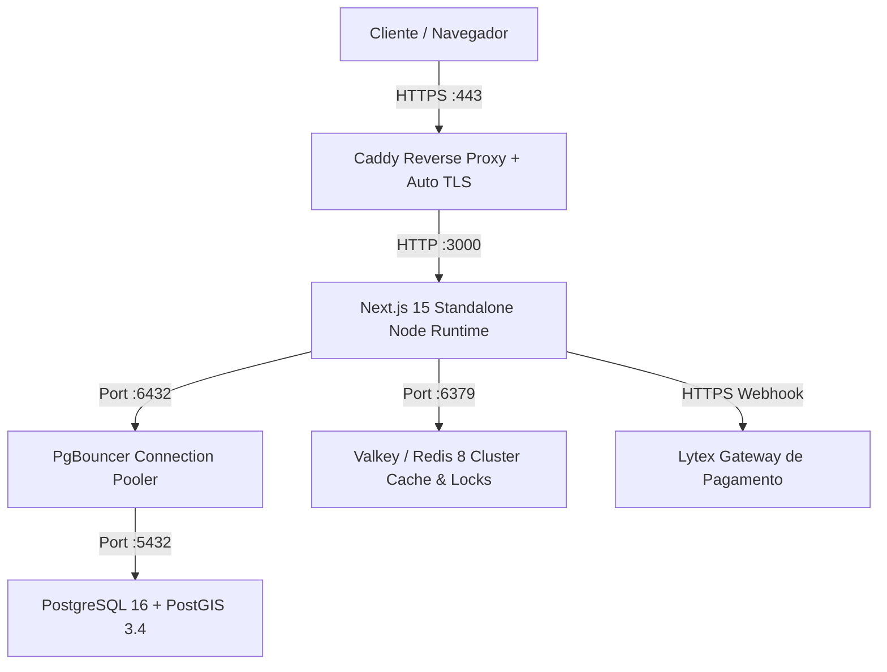

# Runbook Operacional & Manual de Produção — Severinno

> Guia operacional definitivo para deployment, monitoramento, backup, recuperação de desastres e manutenção da plataforma Severinno.

---

## 🏗️ 1. Arquitetura de Infraestrutura

A aplicação roda em stack conteinerizada otimizada para alta performance e disponibilidade:



---

## 🚀 2. Procedimento de Deploy (Zero-Downtime)

### 2.1 Pre-Flight Checklist

Antes de qualquer release em ambiente de produção:

1. Validar integridade dos testes: `bun run test:run` (100% passing).
2. Validar tipagem TypeScript: `bun run typecheck`.
3. Executar o smoke test de produção: `bun scripts/smoke-test-prod.ts`.

### 2.2 Comandos de Deploy

```bash
# 1. Atualizar repositório
git pull origin main

# 2. Instalar dependências e gerar cliente Prisma
bun install --frozen-lockfile
bun run db:generate

# 3. Aplicar migrations pendentes do banco
bunx prisma migrate deploy

# 4. Compilar bundle standalone de produção
BUILD_STANDALONE=true bun run build

# 5. Reiniciar container da aplicação
docker compose restart web
```

---

## 💾 3. Backups e Recuperação de Desastres

### 3.1 Backup Automatizado do Banco

O script automatizado gera dump comprimido com schemas e triggers PostGIS:

```bash
# Execução manual ou via cron diário (03:00 AM)
./scripts/backup-db.sh
```

_Destino:_ `/backups/postgres_YYYYMMDD_HHMMSS.sql.gz`

### 3.2 Procedimento de Restauração (Restore)

```bash
# Restaurar a partir do snapshot mais recente
./scripts/restore-db.sh /backups/postgres_20260813_030000.sql.gz
```

---

### 3.3 Backup da Forja (Gitea) — diário, com verificação e off-site

> A forja (git + registry OCI) vive no volume docker `gitea-data` da VPS. O backup dela tem DUAS famílias de artefato: o export oficial (`gitea dump`) para restauração e um `git bundle` por repositório (formato git puro, sobrevive a qualquer forja). Forja vazia é estado declarado no manifest, não falha.

**Na VPS (`/root/forge-backup.sh`, cron 04:30 — sincronizado com `scripts/forge-backup.sh` do repo):**

```bash
# manual: bash /root/forge-backup.sh
# artefatos: /root/backups-forja/<dia>/{forge-dump.zip, git-*.bundle, manifest.txt, sha256sums.txt}
# retenção local: 14 dias
```

**Off-site (na máquina local, `scripts/forge-backup-pull.sh`, cron 05:15):**

```bash
# puxa o dia, confere sha256 contra o manifest DA VPS e verifica cada bundle (git bundle verify)
bash scripts/forge-backup-pull.sh [dia]
# destino: ~/backups-forja/<dia>/ — retenção local: 30 dias
```

**Por que o pull e não o push:** a VPS não guarda credencial do destino off-site — uma VPS comprometida não apaga nem corrompe a cópia que fica fora dela. Um backup sem verificação é esperança, não backup: o `sha256sum -c` local e o `git bundle verify` são o que tornam o artefato confiável no dia do desastre.

**Restauração da forja a partir do dump** (mesma série do gitea, volume novo):

```bash
# 1. sobe a stack parada do app e do runner
docker compose -f deploy/docker-compose.gitea.yml up -d gitea
# 2. restaura o dump oficial (o zip contém app.ini, gitea-db.sql, anexos e repos)
docker exec -i gitea su git -c 'unzip -o /tmp/forge-dump.zip -d /tmp/restore && gitea restore -f /tmp/restore'
# 3. sobe o resto: docker compose -f deploy/docker-compose.gitea.yml up -d
```

**Pré-requisito do 100% self-hosted (verificado em 29/09):** a forja de bring-up novo nasce SEM `/data/git/repositories` — o `forge-backup.sh` cria o dir antes do dump. Forja vazia (`bundles: 0`) é estado normal, não erro.

---

## 🛡️ 4. Monitoramento & Alertas

### 4.1 Health Check Endpoints

- **Liveness:** `GET https://severinno.com.br/api/health` → Retorna status básico HTTP 200.
- **Deep Check:** `GET https://severinno.com.br/api/health/detailed` → Avalia latência de PostgreSQL, Redis, PostGIS e serviços externos.

### 4.2 Métricas do PgBouncer

- **Pool Status:** `GET https://severinno.com.br/api/admin/pgbouncer` (Requer autenticação ADMIN).

---

## 🔒 5. Segurança & Variáveis Críticas

| Variável               | Descrição                                            | Importância |
| ---------------------- | ---------------------------------------------------- | :---------: |
| `DATABASE_URL`         | String de conexão via PgBouncer                      | 🔴 Crítico  |
| `SESSION_SECRET`       | Chave de assinatura de cookies HMAC (32+ caracteres) | 🔴 Crítico  |
| `CRON_SECRET`          | Bearer token para execução de crons externas         | 🔴 Crítico  |
| `LYTEX_API_TOKEN`      | Token da API de pagamentos Lytex                     | 🔴 Crítico  |
| `LYTEX_WEBHOOK_SECRET` | Segredo de validação de assinatura do webhook        | 🔴 Crítico  |
