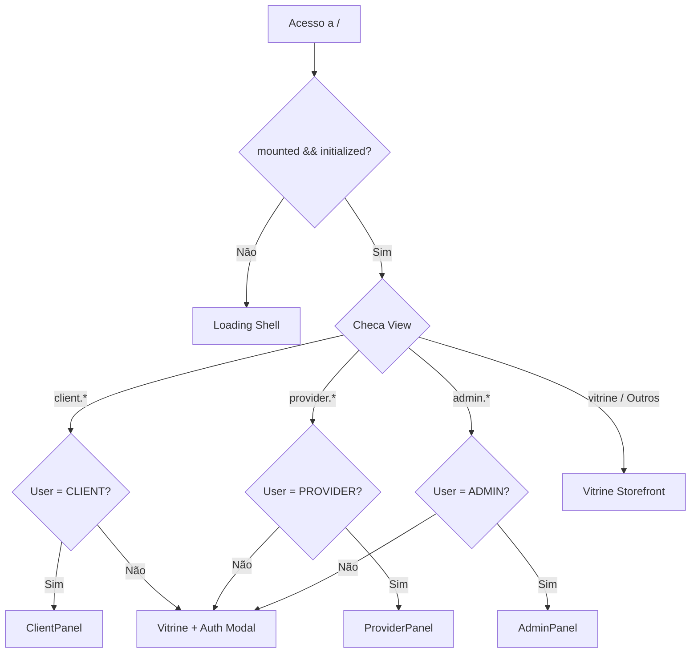

# 📄 Relatório de Análise de Código: Severinno Marketplace

O **Severinno Marketplace** é uma plataforma SaaS residencial para contratação de prestadores de serviços por proximidade geográfica (estilo Uber/iFood, mas voltada a reparos e serviços domésticos).

---

## 🛠️ Stack Tecnológica

| Camada                      | Tecnologia                                    | Detalhes                                                                                                     |
| :-------------------------- | :-------------------------------------------- | :----------------------------------------------------------------------------------------------------------- |
| **Frontend**                | React 19 + Next.js 16 (App Router, Turbopack) | SPA no cliente orientada por troca de views no Zustand.                                                      |
| **Estilização**             | Tailwind CSS v4 + shadcn/ui                   | Design System baseado na cor de destaque **Emerald** (Esmeralda).                                            |
| **Gerenciamento de Estado** | Zustand + XState                              | Zustand para estados globais (auth, geo, view, UI) e XState para fluxos complexos (Checkout e Rastreamento). |
| **Banco de Dados**          | PostgreSQL 16 + Extensão PostGIS 3.4          | Capacidades geoespaciais nativas (armazenamento e consultas geográficas rápidas). ORM Prisma (v6.11.1).      |
| **Mensageria e Filas**      | RabbitMQ 4                                    | Consumers em background rodando de forma assíncrona para e-mails e notificações.                             |
| **Cache & Sessão**          | Redis 7                                       | Controle de taxa (Rate Limiting) e cache geográfico de alta velocidade.                                      |
| **Comunicação Realtime**    | WebSocket (Socket.io 4)                       | Mini-serviço rodando na porta `3003` para chat, notificações e tracking ao vivo.                             |
| **Roteamento de Distância** | OSRM (Open Source Routing Machine)            | Cálculo de rotas e distâncias de transporte reais (com fallback matemático via fórmula de Haversine).        |
| **Autenticação**            | Session-based (cookie httpOnly)               | Token customizado assinado via HMAC-SHA256 (`severinno_session`).                                            |
| **Armazenamento**           | Compatível com S3 (Cloudflare R2)             | Uploads processados via Sharp para formato WebP com fallback local no disco.                                 |
| **Testes & Diagnóstico**    | Vitest + Playwright                           | Testes unitários com Vitest e testes E2E/Visuais com Playwright.                                             |

---

## 🏗️ Arquitetura do Sistema

### 1. Roteamento SPA no Cliente (`useViewStore`)

Apesar de usar Next.js App Router, para os painéis de usuário logado a plataforma adota o conceito de **Single Page Application (SPA)** a partir da rota principal `/`.

- O componente principal [page-client.tsx](file:///c:/PROJETOS/$everinno__Produto/src/app/page-client.tsx) monitora o estado de `view` da store global do Zustand ([view.ts](file:///c:/PROJETOS/$everinno__Produto/src/store/view.ts)).
- As views são strings no formato `categoria.secao` (ex: `client.bookings`, `provider.services`, `admin.taxonomy`, `vitrine`).
- Um **Auth Guard** reativo no shell redireciona o usuário para a vitrine caso ele tente acessar uma view restrita à sua Role sem estar devidamente autenticado.



### 2. Mini-serviço de Comunicação Realtime

Localizado em `mini-services/realtime/`, roda de maneira desacoplada utilizando **Bun** na porta `3003`.

- Ele lida com eventos WebSocket e expõe uma API HTTP `/emit` para que as rotas de API do Next.js possam propagar mensagens em tempo real para os clientes (ex: envio de chats, mudança de status de agendamento e posições GPS do prestador).
- As salas (rooms) de conexão do Socket.io são isoladas por usuário (`user:{userId}`) e por papel (`role:{role}`).

---

## 📂 Estrutura de Diretórios Principal

```
c:/PROJETOS/$everinno__Produto
├── .agents/                    # Configurações do AG Kit (regras, agentes e memória persistente)
├── mini-services/              # Microserviços auxiliares independentes
│   └── realtime/               # Servidor de WebSocket (Socket.io) escrito em TypeScript
├── prisma/                     # Configurações do Banco de Dados
│   ├── schema.prisma           # Schema contendo 13 modelos relacionais
│   └── seed.ts                 # Seed com 9 usuários mockados e árvore completa de serviços
├── src/                        # Código fonte do Next.js
│   ├── app/                    # Next.js App Router (Layouts, Páginas estáticas, Rotas de API)
│   │   ├── api/                # 36 Endpoints HTTP (Auth, Reservas, Orçamentos, Mensagens, Upload, etc.)
│   │   └── page-client.tsx     # Orquestrador de views do cliente (Router da SPA)
│   ├── components/             # Componentes de UI divididos por escopo
│   │   ├── admin/              # Componentes do Dashboard do Administrador
│   │   ├── client/             # Componentes do Dashboard do Cliente
│   │   ├── provider/           # Componentes do Dashboard do Prestador
│   │   ├── modals/             # Modais globais controlados por UI Store (Auth, Checkout, Booking)
│   │   ├── shared/             # Layouts globais (dashboard-shell, widgets) e inputs complexos
│   │   └── ui/                 # Primitivos do shadcn/ui configurados com Tailwind v4
│   ├── hooks/                  # Hooks customizados (realtime, tracking de GPS, XState hooks)
│   ├── lib/                    # Utilitários de infraestrutura (auth, crypto, geolocalização, api-client)
│   ├── store/                  # Stores Zustand (Auth, Geo, UI, View, etc.)
│   └── machines/               # Máquinas de estado do XState (Checkout e Tracking de pedido)
└── worklog.md                  # Log com histórico detalhado do desenvolvimento de cada tarefa
```

---

## 💾 Modelagem de Dados (Prisma Schema)

O banco de dados do Severinno gerencia os seguintes modelos fundamentais:

- **User**: Base comum para Clientes, Prestadores e Administradores. Guarda as coordenadas geográficas (`lat`, `lng`) da base de atendimento do prestador ou endereço do cliente, raio máximo de cobertura (`radiusKm`) e campos adicionais de integração bancária (`lytexRecipientId`).
- **Category**: Árvore estruturada em até 3 níveis (Pai > Filha > Subcategoria) para busca semântica otimizada de serviços (definida conforme [TAXONOMIA.md](file:///c:/PROJETOS/$everinno__Produto/TAXONOMIA.md)).
- **Service**: Os serviços oferecidos por cada prestador sob determinada categoria, com preço base e unidade de medição (ex: metro quadrado, hora, unidade fixa).
- **ProviderAvailability** e **DateBlock**: Definições semanais de horário de expediente do prestador e bloqueio de datas específicas (ex: folgas, férias).
- **QuoteRequest** & **QuoteItem**: Fluxo de cotação/orçamento múltiplo iniciado pelo cliente para um prestador.
- **Booking**: Registro de agendamentos agendados, transacionando entre os estados `PENDING`, `CONFIRMED`, `IN_PROGRESS`, `COMPLETED` e `CANCELLED`.
- **Review**: Avaliação atribuída pelo cliente a um agendamento finalizado (limite de 1 review por agendamento).
- **Message**: Mensagens diretas de chat entre usuários, associadas opcionalmente a um `bookingId`.
- **Payment**: Dados de pagamento gerenciados por agendamento.
- **Notification** & **PushSubscription**: Histórico de notificações no aplicativo e chaves de inscrição da API do Web Push do navegador.

---

## 🔄 Fluxos Críticos do Sistema

### A. Busca por Geolocalização (Consulta Espacial)

Ao carregar a Vitrine, o sistema lê o ponto de geolocalização do usuário (obtido via GPS do navegador ou digitando um CEP integrado com a API ViaCEP).

1. A rota [api/providers/route.ts](file:///c:/PROJETOS/$everinno__Produto/src/app/api/providers/route.ts) calcula a distância de cada prestador baseado na sua latitude e longitude cadastradas.
2. É retornado o vetor de prestadores ordenados por proximidade ou classificação, exibindo-os em um mapa vetorial interativo baseado em **MapLibre GL JS** com tiles livres do OpenStreetMap.

### B. Checkout de Agendamento (XState + Stepper)

Quando um cliente clica para agendar um serviço, a máquina de estado ([checkout.machine.ts](file:///c:/PROJETOS/$everinno__Produto/src/machines/checkout.machine.ts)) gerencia as etapas de contratação através do [booking-modal.tsx](file:///c:/PROJETOS/$everinno__Produto/src/components/modals/booking-modal.tsx):

1. **Passo 1 (Calendário & Slots)**: Carrega a disponibilidade real do prestador e gera slots de 60 minutos dinamicamente.
2. **Passo 2 (Dados & Endereço)**: Coleta informações de local e observações com auto-preenchimento por CEP.
3. **Passo 3 (Pagamento Mockado)**: Permite escolher cartão (com layout mock de simulação) ou PIX com código copiável.

---

## 🏃 Como Rodar o Projeto Localmente

No terminal rodando na máquina:

1. **Instalação das dependências**: `bun install`
2. **Infraestrutura via Docker**: `docker compose up -d postgis redis rabbitmq`
3. **Configuração inicial do banco de dados**: `bunx prisma migrate dev` (ou `prisma db push`)
4. **Seed de dados demo**: `bun run seed`
5. **Servidor de desenvolvimento**: `bun run dev`
6. **Worker de filas em background (opcional)**: `bun run consumer` (notificações) e `bun run email-consumer` (e-mails)
7. **Servidor realtime independente (WebSocket)**: `cd mini-services/realtime && bun index.ts`
